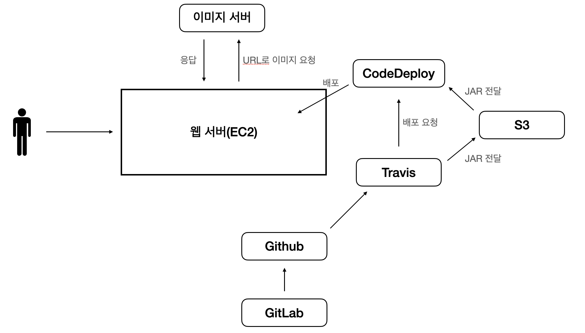
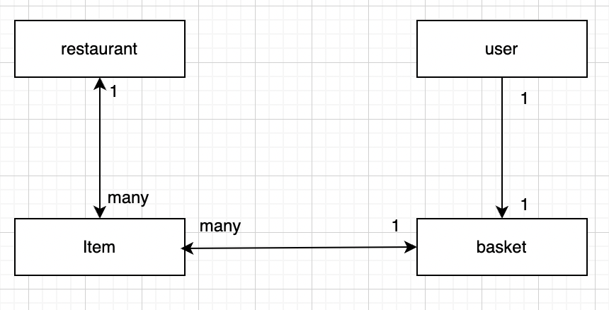

## 너만의 웨이터

### 서비스 소개
&nbsp;&nbsp;&nbsp; 키오스크, 종업원 없이 음식을 주문할 수 있도록 도와주는 웹 어플리케이션

### 프로그램 전체 구조
1. Gitlab과 GIthub 미러링을 이용하고 있습니다.
2. Github로 커밋이 되면, Travis와 CodeDeploy를 이용하여 자동 배포되도록 하고 있습니다. 
3. AWS EC2를 이용하여 배포하였고, S3를 이미지 서버처럼 사용하고 있습니다.

### 프로젝트의 관심사
1. 데이터 베이스 설계 연습
2. 스프링 시큐리티를 통한 고객과 영업점의 권한 관리
3. Validation을 이용한 유효성 검증 적용
4. AWS EC2와 S3 공부 및 적용
5. Travis와 CodeDeploy를 이용한 CI/CD 공부 및 적용 

### 사용 기술 및 환경
SpringBoot, JPA, Java11, MySQL, Gradle, Travis, CodeDeploy

### DB설계
